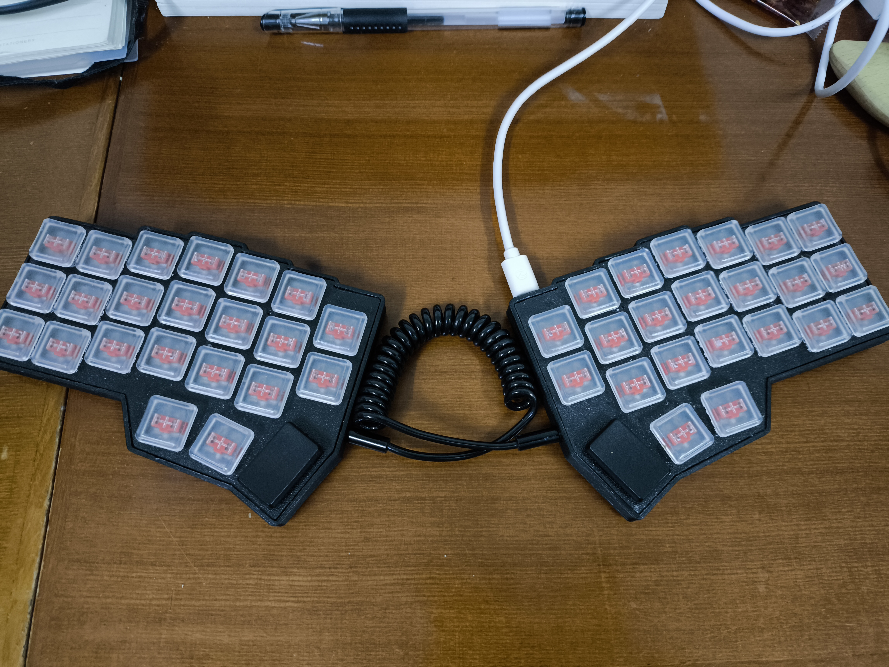
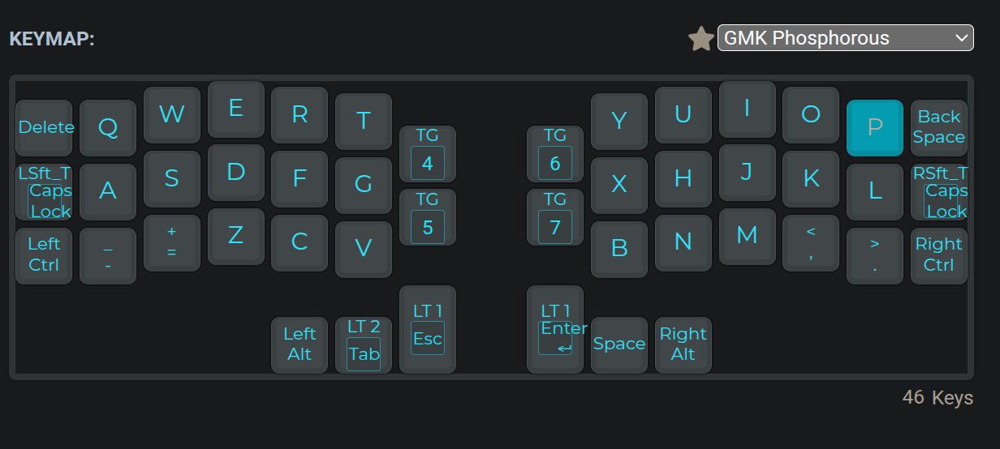
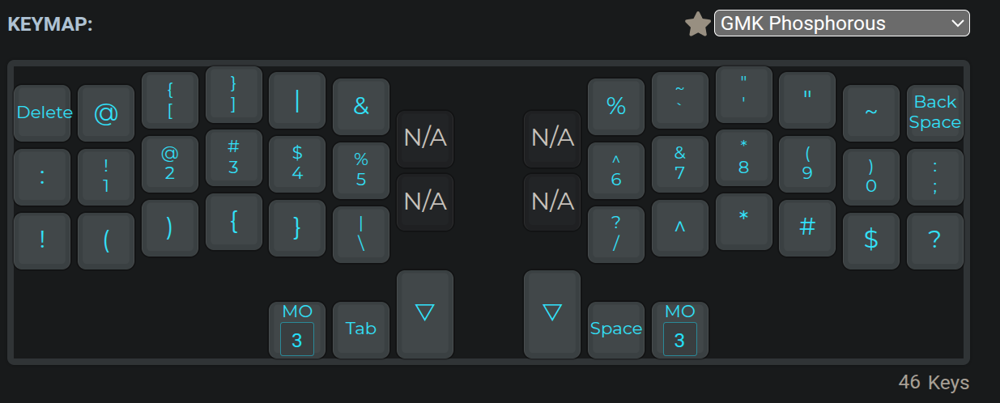
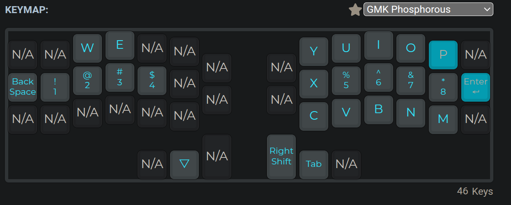
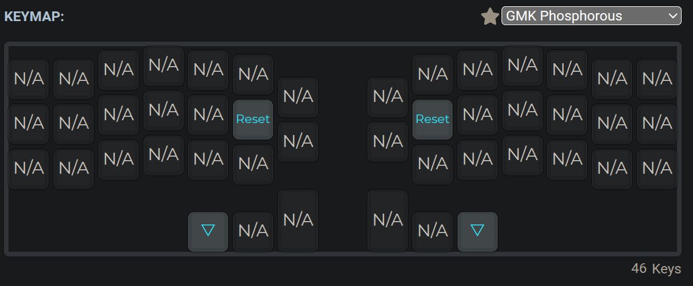
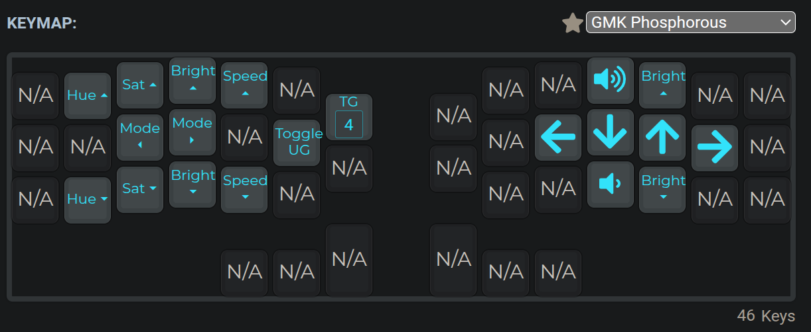
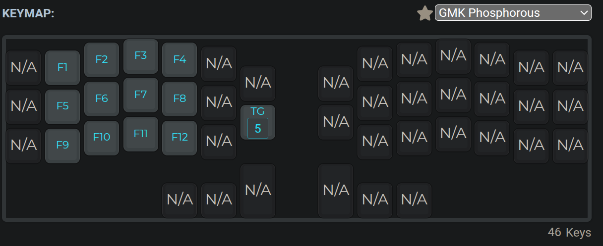
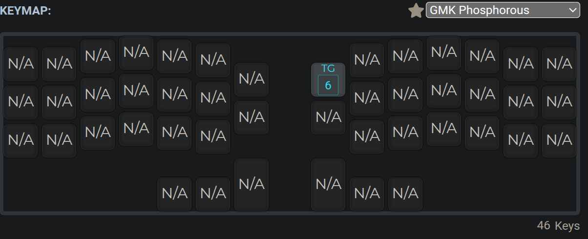
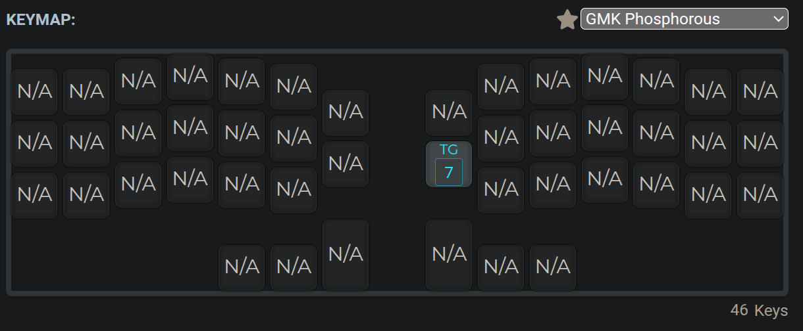

# Corne and Lucky

This repo is used by myself(I just wanted to save off my keymaps without merging them with the official repository).

I use "lucky" keymap on [corne](https://github.com/foostan/crkbd)(crkbd, corne keyboard). And lucky is designed by my self.

The Keyboard version is crkbd/rev4_1/standard and layout is 3x6_3_ex2.

My keymap is at /keyboards/crkbd/keymaps/lucky.

## Show

## Key Map

> [!TIP]
> Some keys may have slight changes, and new keys may be added to the 5678th level. This picture is for reference only.

* Layer0
    
* Layer1
    
* Layer2
    
* Layer3
    
* Layer4
    
* Layer5
    
* Layer6
    
* Layer7
    

You can see that I still have some levels that I haven't used yet, maybe I'll save them for some special cases.

## DIY

### Hardware

> [!TIP]
> Every thing that you want is in [corne doc](https://github.com/foostan/crkbd/tree/main/docs).

I use "嘉立创" manufacture PCBs, and I have a 3D print in my home, so I can printer the shell by my self.

I asked dad to help me with soldering(♥️Love you dad).

I use Short sharf.(For Chinese: 你可以在淘宝上找到卖矮轴和矮轴键帽, 并没有很贵).

### Software

You can use [QMK Config](https://config.qmk.fm/) to generate the json file(Keymap file).

I'm Arch user, I install qmk cli by `sudo pacman -S qmk`.

QMK cli can help you generate keymap.c file by json file and compile it.

Then follow the below steps to finish the fine configuration easily.

1. Clone this or official repository. `git clone git@github.com:dty2/qmk_firmware.git`
2. Set env `export QMK_HOME=/dir/to/qmk` in your '.zshrc' or '.bashrc'.
3. Init qmk `qmk setup`
4. Init keymap `qmk new-keyboard -kb corne/rev4_1/standard -km lucky` Or directly put the lucky dir in the directory where this document is located into the qmk_firmware/keyboard/crkbd/keymaps/ dir
5. Change your json file to keymap.c, and use the new c file replace the old file in qmk_firmware/keyboard/crkbd/keymaps/ dir
by  `qmk json2c -o keymap.c lucky.json`.
6. Modify the config.h file and keymap.c file as required
7. Compile out the uf2 file `qmk compile -kb corne/rev4_1/standard -km lucky` or `qmk compile -kb crkbd -km lucky`(if you want use defult keymap).
8. Reset you keyboard, and mount it, and copy the uf2 file to the mounted dir, umount and then it is done.

> [!TIP]
> Press and hold the two keys on the upper left corner and the two keys on the upper right corner and then insert the USB port to reset.

## Help Link

[QMK Document](https://qmk.fm/)

[QMK Config](https://config.qmk.fm/)

[Corne](https://github.com/foostan/crkbd)

## Other Solutions

[Adam13531](https://github.com/Adam13531/qmk_firmware)
